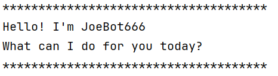

# Joebot666 User Guide




Joebot666 is a personal assistant chatbot that helps users manage their tasks.
It supports adding, marking, unmarking, deleting, and finding tasks, as well
as saving and loading tasks from a file.
The chatbot interacts with users through a command-line interface.
It uses classes such as TaskList, Command, Parser, Storage, and Ui to handle
various functionalities.

## Quick Start Guide
1. Ensure you have Java 17 or above installed on your system.
2. Download the Joebot666.jar file from the releases section of the repository.
3. Copy the jar file to your desired directory.
4. Open a terminal and navigate to the directory where you copied the jar file.
5. Run the chatbot using the command: `java -jar Joebot666.jar`.
6. A welcome message will be displayed, and you can start interacting with the chatbot.


## Adding todo tasks
Adds TODO tasks to your task list.

Description must not be empty.

Some examples of usage:
```
    todo read book
    todo return book
```
Example: `todo <description>`

Expected output:

```
Got it. I've added this task:
  [T][ ] read book
Now you have 9 tasks in the list.
*************************************
```

## Adding Deadline Task
Adds DEADLINE tasks to your task list.
Description and by must not be empty.
By must be in the format DD/MM/YYYY HHMM.
Some examples of usage:
```
    deadline return book /by 15/09/2025 1800
    deadline submit report /by 01/10/2025 2359
```
Example: `deadline <description> /by <DD/MM/YYYY HHMM>`
Expected output:
```
Got it. I've added this task:
  [D][ ] return book (by: 15/09/2025 1800)
Now you have 11 tasks in the list.
```

## Adding Event Task
Adds EVENT tasks to your task list.
Description, from and to must not be empty.
From and to must be in the format DD/MM/YYYY HHMM.
Some examples of usage:
```
    event project meeting /from 20/09/2025 1400 /to 20/09/2025 1600
    event team outing /from 25/09/2025 1000 /to 25/09/2025 1800
```

Example: `event <description> /from <DD/MM/YYYY HHMM> /to <DD/MM/YYYY HHMM>`
Expected output:
```
Got it. I've added this task:
[E][ ] project meeting (from: 20/09/2025 1400 to: 20/09/2025 1600)
Now you have 12 tasks in the list.
```

## Listing Tasks
Lists all tasks in your task list.
Some examples of usage:
```
    list
```
Example: `list`
Expected output:
```
Here are the tasks in your list:
1. [D][ ] test (by: 25/09/2025 1800)
2. [E][ ] hello (from: 24/08/2025 0000 to: 25/09/2025 1700)
3. [T][ ] read book
```
## Marking Tasks as Done
Marks a task as done based on its index in the task list.
Index must be a valid integer within the range of the task list.
Some examples of usage:
```
    mark 2
    mark 1
```
Example: `mark <index>`

Expected output:
```
Nice! I've marked this task as done:
  [E][X] hello (from: 24/08/2025 0000 to: 25/09/2025 1700)
``` 

## Unmarking Tasks
Unmarks a task as not done based on its index in the task list.
Index must be a valid integer within the range of the task list.
Some examples of usage:
```
    unmark 2
    unmark 1
```
Example: `unmark <index>`

Expected output:
```
OK, I've marked this task as not done yet:
    [E][ ] hello (from: 24/08/2025 0000 to: 25/09/2025 1700)
```
## Saving Data to File
Joebot automatically saves your tasks to a file named `tasks.txt` in the
`data` directory when you exit the program using the `bye` command.
You do not need to manually save your tasks; they are saved automatically.
Do not unexpectedly exit the program (e.g., by closing the terminal window) as this may
prevent tasks from being saved properly.

## Loading Data from File
Joebot automatically loads your tasks from the `tasks.txt` file in the `data`
directory when you start the program.
If the file does not exist, Joebot will start with an empty task list.
You do not need to manually load your tasks; they are loaded automatically.

## Deleting Tasks
Deletes a task from your task list based on its index.
Index must be a valid integer within the range of the task list.
Some examples of usage:
```
    delete 3
    delete 1
```
Example: `delete <index>`

Expected output:
```
Noted. I've removed this task:
  [T][ ] read book
Now you have 8 tasks in the list.
```

## Finding Tasks
Finds tasks that contain a specific keyword in their description.
Keyword must not be empty.
Some examples of usage:
```
    find book
    find meeting
```
Example: `find <keyword>`

Expected output:
```
Here are the matching tasks in your list:
1. [T][ ] read book
2. [D][ ] return book (by: 15/09/2025 1800)
```
## Exiting the Program
Exits the Joebot chatbot program.
Data is saved when the "bye" command is issued.
Some examples of usage:
```
    bye
```
Example: `bye`
Expected output:
```
Saving Data Now...
Bye. See you next time!
```